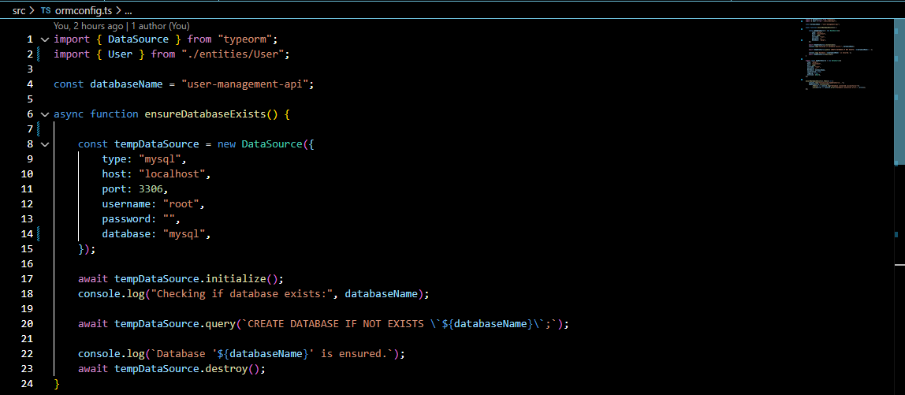
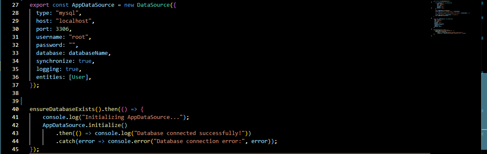
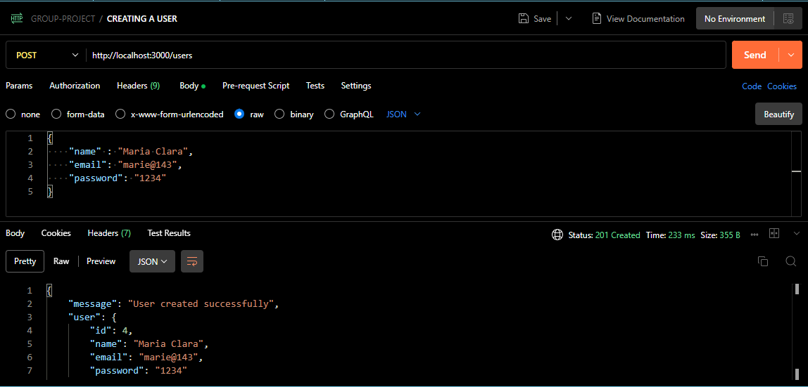
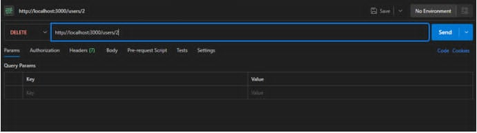
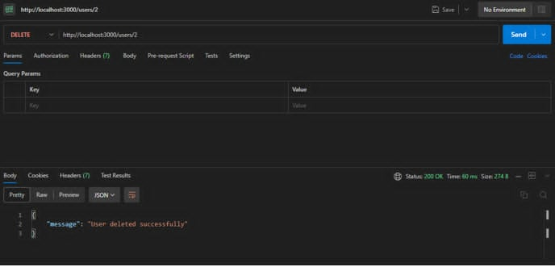
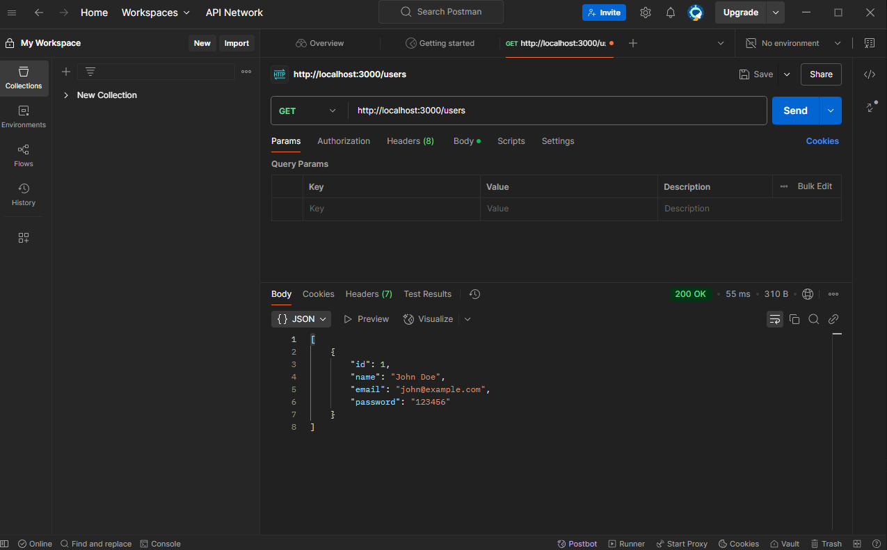

# Group project of REST API for User Mangement

# I. Project Overview
The CRUD (Create, Read, Update, Delete) features of the API are intended for user management. It enables the use of Node.js, Express, TypeORM, MySQL, and TypeScript to manage user accounts in a database. In order to ensure effective user data handling and management, the API offers endpoints for creating new users, retrieving user details, updating user information, and deleting users.

# II. Setup Instructions

1. After the repository is created and provided by the leader, run this command in your terminal.
    -> "git clone https://github.com/nancyromales19/user-management-api.git"

2. Install all dependencies needed.
    -> "npm i bcryptjs cors dotenv express helmet http-status-codes mysql reflect-metadata typeorm uuid"
    -> npm i --save-dev @types/bcryptjs @types/cors @types/dotenv @types/express @types/helmet @types/http-status-codes @types/node @types/uuid ts-node-dev typescript

3. We will then set up our ormconfig.ts with our MYSQL credentials for the database connection.
    
    

# III. API Documentation

CREATION OF USERS - ROMALES
    

DELETING USERS - LOAYON
    
    
 
UPDATING USER DETAILS - GURREA

RETRIEVING USER DETAILS - LOPEZ
    
